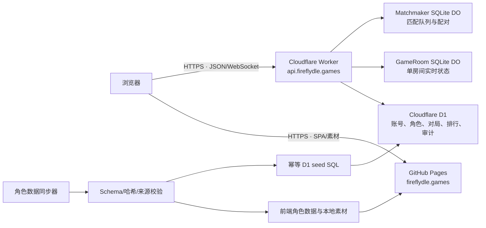

# Fireflydle 架构

## 目标与边界

Fireflydle 是一个静态前端加边缘 API 的非官方粉丝项目。生产环境优先使用可在免费额度内运行的托管服务：GitHub Pages 托管 SPA，Cloudflare Workers 运行 API，D1 保存长期关系数据，SQLite Durable Objects 保存需要强一致性的房间与匹配状态。

架构刻意保持两个边界：

- 浏览器永远不直接访问 D1 或 Durable Object，只访问 `https://api.fireflydle.games`。
- 角色数据、版本化内容 manifest、图片和 D1 角色池是一个发布单元，不允许通过独立定时任务分别更新。

免费额度和产品限制会变化，生产管理员仍需在 GitHub 与 Cloudflare 控制台开启用量提醒。域名注册本身不属于免费托管范围。

## 运行时拓扑

### Web

`apps/web` 是 React、Vite 与 React Router 构建的单页应用。Vite 输出 `apps/web/dist`，构建时通过 `VITE_API_URL=https://api.fireflydle.games` 固定生产 API 地址。构建插件复制 `index.html` 为 `404.html`，让 GitHub Pages 上的客户端路由可刷新。

`/` 默认进入普通角色模式 `/playable`，模式外壳只从当前版本内容 manifest 注册可用活动；`/playable/daily`、`/playable/practice` 与 `/playable/duel` 分别承接每日、练习和对战流程。每日与练习先进入准备页，通过只读的 `GET /api/games/current` 恢复状态，只有用户明确点击开始后才调用 `POST /api/games`。服务不可用时，单人模式可以进入不保存、不计入统计和排行的离线练习；排位对战始终要求注册账号。

角色图片随 Pages 构建产物发布，不从运行时第三方 CDN 直接读取。浏览器因此看到的角色清单、图片 manifest 与本次发布相互匹配。

### API Worker

`apps/api` 使用 Hono 与 Cloudflare Workers。Worker 负责：

- 访客、注册账号、会话与权限边界；
- 通过 Cloudflare Email Service 发送限流的密码重置、验证和运维告警邮件；
- 每日和随机对局、猜测判定、回放及排行；
- 1v1 房间、匹配与 WebSocket 协调；
- 定时清理过期的会话和目录数据；
- 统一错误结构、请求 ID、CORS 与安全 Cookie。

生产 CORS 只接受 `https://fireflydle.games` 和 `https://www.fireflydle.games`，并允许凭据。线上会话 Cookie 使用 `Secure`、`HttpOnly`、`SameSite=Lax` 和 `Domain=.fireflydle.games`，因此主站与 API 子域可以共享同站会话，而第三方站点不能读取 Cookie。

### D1

D1 是长期、可查询的数据源，包含账号、会话、角色、每日目标、对局、匹配归档、评分事件、公告、审计日志和运维日汇总。schema 由 `apps/api/migrations/*.sql` 单向演进，Wrangler 在 `d1_migrations` 表记录已应用版本。

请求延迟与状态码写入 Workers Analytics Engine，不为每个请求增加 D1 写入。D1 只保存访问会话、每日首次活跃、账号流程计数、脱敏错误和预警；会话/错误明细保留 7 天，日汇总保留 180 天。Analytics Engine 按 Cloudflare 当前托管策略保留 90 天，但后台只查询最近 7 天；其中用户标识每天使用 SHA-256 重新匿名化，数据点不包含原始用户 ID、访问会话 ID、请求正文、Cookie、令牌、邮箱或 IP。

单人对局的核心不变量是：每名用户每天只有一个 `daily` 活动对局，且每个内容模式同时只有一个 active `practice` 活动对局。创建接口采用 start-or-resume，模式固定猜测次数来自对局绑定的规则快照。猜测、认输与结果摘要在同一个 D1 batch 中用条件写入完成裁决；访客登录已有账号时由 `guest_progress_merges` 账本提供一次性合并边界，冲突的每日成绩不会迁入目标账号。

同步器生成 `packages/game-data/generated/characters.sql`。该文件按角色 ID 幂等 UPSERT，并对权威清单中已移除的角色做 soft-disable；不会删除已被历史对局引用的行。Wrangler D1 import 不接受文件中的显式 `BEGIN`/`COMMIT`，所以失败后直接重跑同一 seed，而不是依赖客户端事务语句。

### SQLite Durable Objects

`GameRoom` 持有单个房间的倒计时、回合、玩家连接与猜测热状态；`Matchmaker` 串行化匹配队列和配对决策。二者使用 SQLite 存储后端，由 `apps/api/wrangler.jsonc` 的 Durable Object migration 创建。

房间结束后，需要长期保留的结果写回 D1。D1 是归档和排行的查询源，Durable Object 不是跨房间报表数据库。

## 共享包

- `packages/contracts`：Zod schema 与跨端 TypeScript 类型，是网络和角色数据的信任边界。
- `packages/game-engine`：无平台依赖的判定、日期、分享与匹配规则，可由 Bun 直接测试。
- `packages/game-data`：经过校验的角色、阵营、版本和来源元数据，以及发布用 D1 seed。

依赖方向保持为应用依赖共享包；共享包不依赖 Web、Worker、D1 或 Durable Object。这让核心规则可以脱离平台执行单元测试。

## 数据发布一致性

一次生产发布由手动发布的 GitHub Release 触发，标识由 Release tag、Git commit、GitHub Actions run 和素材 manifest 摘要共同确定。流水线先确认 tag 指向 `main` 历史中的 commit；`.github/workflows/deploy.yml` 只同步一次数据，然后：

1. 校验数据来源、schema、素材哈希与生成文件；
2. 对同步后的工作区执行格式、类型、测试和构建检查；
3. 上传由该工作区生成的 GitHub Pages artifact；
4. 把同次生成的 manifest、manifest 摘要和 D1 seed 保存为本次 Actions run 专属的 `release-data-*` artifact；
5. 从该 artifact 应用 D1 migration 与角色 seed，再发布绑定了 Cloudflare Email Service 的 Worker；
6. API 健康检查成功后，才发布已经构建好的 Pages artifact。

流水线没有素材专用的 schedule，也没有把图片直接上传到另一个存储服务。即使上游数据发生变化，线上内容也只在完整发布成功后一起变化。跨 GitHub Pages 与 Cloudflare 无法实现真正的分布式原子提交；发布顺序和保留的 artifact 将故障窗口缩小，并为重试与审计提供依据。

因为 D1 migration 发生在 Worker deploy 之前，schema 变更必须遵循 expand/backfill/contract：先添加旧 Worker 可忽略的新结构，完成代码和数据迁移后，再在后续发布清理旧结构。同理，新 API 在 Pages 切换前必须兼容仍在线的上一版前端。

## 安全与运维

- GitHub Actions 默认只有 `contents: read`；只有 Pages 发布 job 拥有 `pages: write` 和 OIDC `id-token: write`。
- Cloudflare 凭据只存在于受保护的 `production-api` GitHub Environment，不写入仓库、构建产物或命令行参数。
- `api.fireflydle.games` Custom Domain 在首次引导时由 Cloudflare 控制台绑定；生产配置不声明 routes，因此 CD token 不拥有 Zone 权限，也不会在每次代码发布时重复写路由。
- 邮件通过 `apps/api/wrangler.jsonc` 的 `EMAIL` `send_email` binding 发送，不保存第三方邮件 API secret；发件地址和公开站点 URL 是版本控制中的非秘密配置。
- 管理概览使用独立的 `CLOUDFLARE_ANALYTICS_TOKEN` Worker secret，只授予 Account Analytics Read；不会复用部署 token。
- 生产部署使用并发锁且不取消进行中的发布，避免两个 migration/seed 同时执行。
- D1 变更优先使用向前修复；破坏性恢复必须先评估会丢失的用户写入。
- Durable Object class migration 是命名空间生命周期操作，不能当作普通代码版本回滚。

详细的账号、DNS、迁移、发布和回滚步骤见 [DEPLOYMENT.md](./DEPLOYMENT.md)。
